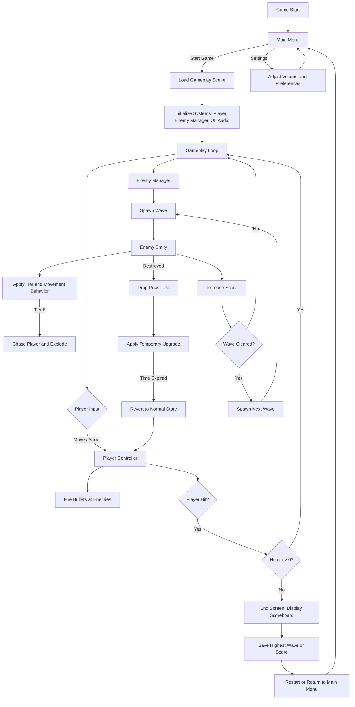
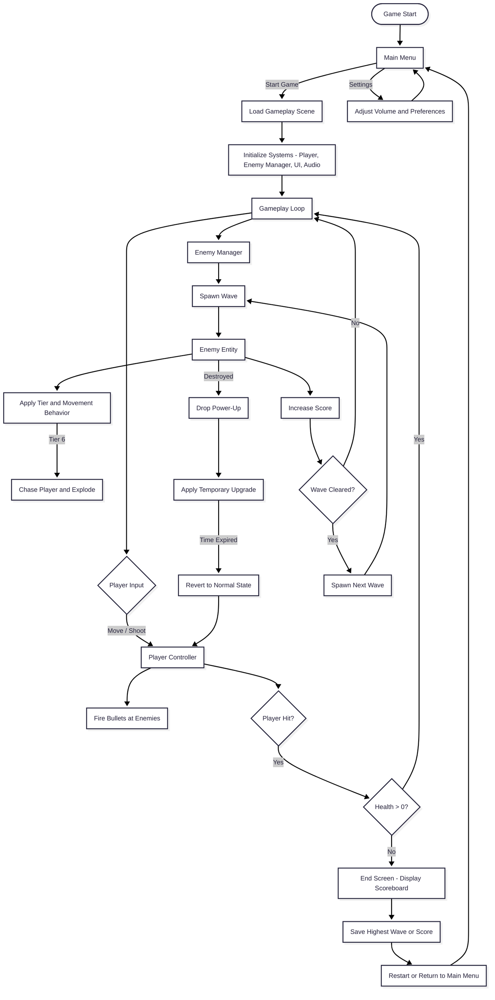
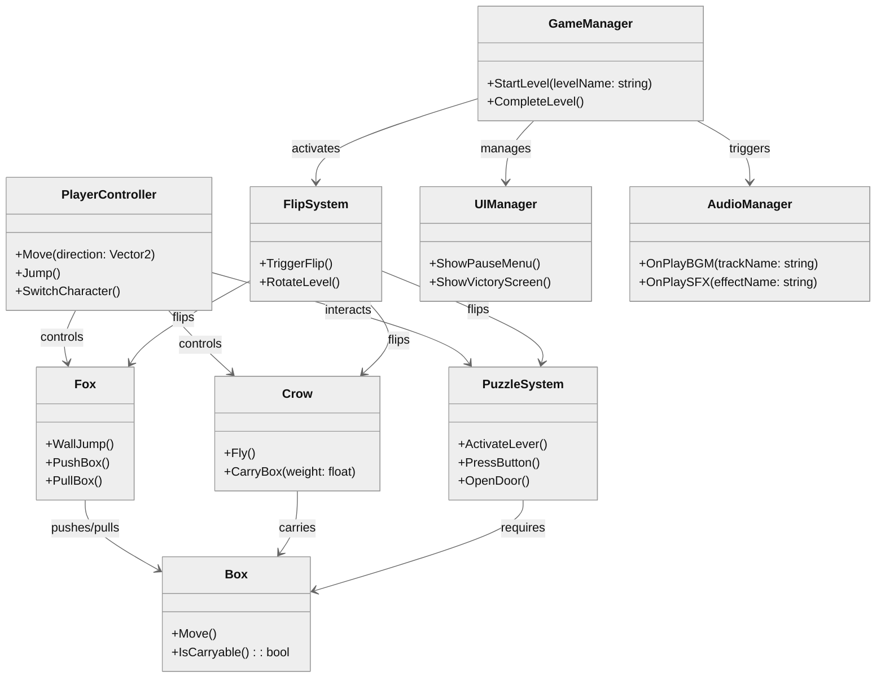

## Developer & Contributions

Muhammad Rafi Ramadhan (Game Developer and Game Designer)
   

## About

Space Invaders Evolved is a fast-paced arcade shooter where you face endless waves of alien enemies. Multiple enemy types keep you on your toes. bombers that dive in for explosive damage, and snipers that fire deadly lasers to block off sections of the arena. Power-ups drop from enemies giving temporary boosts like explosive bombs, knockback blasts, and multishot upgrades that can stack up to four shots. The longer you survive, the harder and more chaotic the battle becomes.
 

## Key Features & Personal Contributions
Core Gameplay Features
- **Endless Wave System** — Implemented continuous enemy spawning with progressive difficulty scaling.
- **Universal Enemy Behavior System** — Designed a shared behavioral framework governing all enemy types:
  - Enemies descend through six vertical tiers, each representing a phase of approach toward the player.
  - Tier transitions are triggered by the number of wall bounces, with each enemy type having distinct descent speeds and bounce limits.
  - Upon reaching the final (sixth) tier, all enemies switch to aggressive pursuit mode, directly chasing the player and detonating on impact as a punishment mechanic for delayed elimination.
- **Enemy Types & Behaviors**  
  - **Strikers:** Standard enemies that swarm the player in large numbers, firing straightforward projectiles and using group-based movement patterns.
  - **Bombers:**  Slow-moving enemies that drop bombs creating area-of-effect explosions; maintain steady movement and drop rates regardless of wave speed.
  - **Snipers:** Faster enemies that descend through tiers quicker than others, firing lasers that block off sections of the arena.
- **Power-Up System** — Developed instant-activation power-ups with timed effects and stackable upgrades, including:
  - **Explosive Bullets:** Projectiles that detonate with splash damage.
  - **Knockback Bullets:**  Temporary stun and pushback effect on enemies hit.
  - **Multishot Upgrade:** Expands firing capacity up to four simultaneous projectiles.
- **Combat & Player Control** — Designed responsive shooting mechanics, movement controls, and hit detection for a fluid arcade experience.
- **UI and Game Flow** — Created scoring, wave tracking, and game-over logic with corresponding user interface elements.
  
<h3>Personal Contributions</h3>

<em>Solo Developer – responsible for full development cycle</em>

| **System / Feature**                | **Description**                                                                                                                                                | **Time Spent** |
| ----------------------------------- | -------------------------------------------------------------------------------------------------------------------------------------------------------------- | -------------- |
| **Gameplay Architecture**           | Designed and implemented the main game loop, wave progression, and difficulty scaling systems.                                                                 | ~6 hours       |
| **Universal Enemy Behavior System** | Built a shared behavioral framework controlling tier-based descent, bounce tracking, and final pursuit mechanics across all enemy types.                       | ~6 hours       |
| **Enemy AI & Behaviors**            | Programmed three enemy archetypes (Strikers, Bomber, Sniper) with individual movement, attack, and descent-speed parameters integrated into the universal system. | ~5 hours       |
| **Power-Up Mechanics**              | Implemented a system for instant-activation power-ups with time-based effects and stackable upgrades.                                                          | ~4 hours       |
| **Player Controls & Combat**        | Developed responsive player control, shooting, and collision systems for consistent arcade gameplay.                                                           | ~5 hours       |
| **UI / Game States**                | Implemented UI components for score tracking, wave indicators, and game-over transitions.                                                                      | ~3 hours       |
| **Balancing & Playtesting**         | Tuned enemy speed, bounce count thresholds, and tier timings for balanced pacing and fair difficulty scaling.                                                  | ~4 hours       |
| **Audio & Visual Integration**      | Integrated explosion effects, laser visuals, and impact sounds to reinforce gameplay feedback.                                                                 | ~4 hours       |

Total Development Time: ~37 hours

  <table width="30%" style="border-collapse: collapse; border: 2px solid #ccc;">
    <tr>
      <td align="center" style="padding: 0;">
        
      </td>
      <td align="center" style="padding: 0;">
        
      </td>
    </tr>
  </table>

<h2>Scene Flow</h2>

 

## Layer / Module Design 

## Modules and Features

The core gameplay of Space Invaders Evolved including player control, enemy wave progression, upgrade mechanics, and score tracking. Each module is responsible for managing specific gameplay, UI, or system-level functionality to ensure stable performance and scalability.
| 📂 **Name**           | 🎬 **Scene / Scope** | 📋 **Responsibility**                                                                                                                                                            |
| --------------------- | -------------------- | -------------------------------------------------------------------------------------------------------------------------------------------------------------------------------- |
| **GameManager**       | **Gameplay**         | - Controls overall game state (active, paused, game over) - Manages game flow between gameplay and end screen - Handles timing, score updates, and wave coordination     |
| **AudioManager**      | **Global**           | - Controls background music and sound effects - Handles mute toggles and audio settings persistence                                                                          |
| **MainMenu**          | **Main Menu**        | - Displays title and main interface - Provides access to game start and exit options                                                                                         |
| **EndScreen**         | **End Scene**        | - Displays post-game results (score, waves survived) - Interfaces with **SaveSystem** to store high scores                                                                   |
| **HUD / UIManager**   | **Gameplay**         | - Manages player HUD including score, health, and active upgrades - Displays current wave number and notifications                                                           |
| **PlayerController**  | **Gameplay**         | - Controls player ship movement, shooting, and health - Handles collision with enemies and projectiles                                                                       |
| **Projectile System** | **Gameplay**         | - Manages player bullet instantiation and movement - Optimizes object reuse using projectile pooling                                                                         |
| **Upgrade System**    | **Gameplay**         | - Handles upgrade drops from defeated enemies - Applies instant temporary effects (e.g., Multishot, Explosive Shots, Knockback) - Manages duration and cooldown tracking |
| **EnemyManager**      | **Gameplay**         | - Central controller for all enemy-related logic - Integrates **Wave** and **Tier** systems for pacing and progression - Coordinates spawn timings and enemy variations  |
| **SpawnManager**      | **Gameplay**         | - Spawns enemies at calculated positions per wave - Randomizes spawn timing and enemy type for gameplay variety                                                              |
| **EnemyEntity**       | **Gameplay**         | - Defines base enemy behavior (movement, attack, destruction) - Handles collision detection and triggers power-up drops upon death                                           |
| **SaveSystem**        | **Global**           | - Saves and retrieves persistent data such as high scores and best wave reached                                |

 

## Game Flow Chart

 

## Event Signal Diagram

 
